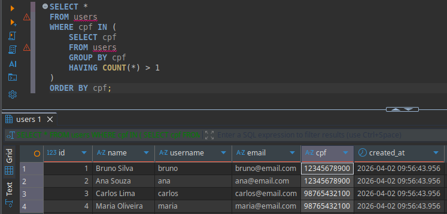
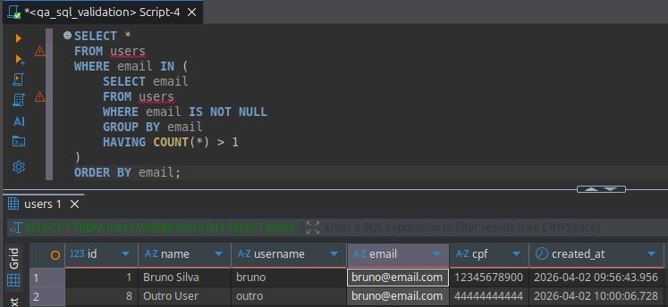
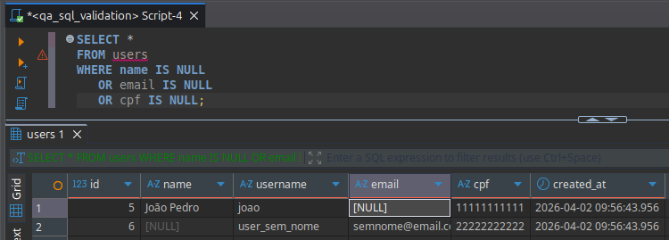
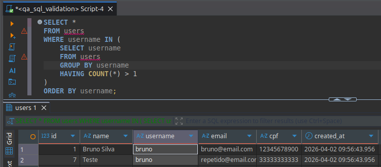
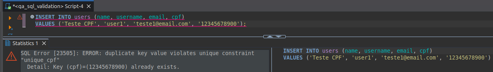
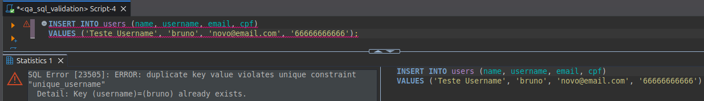
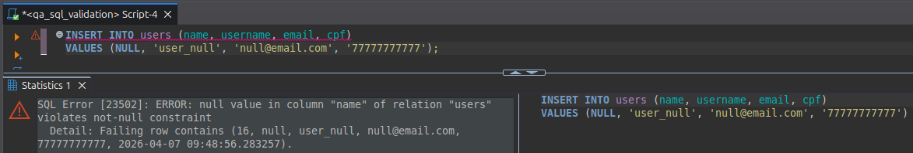

# Test Results — SQL Validation Testing

---

## 🇧🇷 Português

# Fase 1 — Sem Constraints (Detecção)

## Resumo

| Teste | Descrição                 | Resultado |
|------|--------------------------|----------|
| 01   | CPF duplicado            | FAIL     |
| 02   | Email duplicado          | FAIL     |
| 03   | Campos NULL              | FAIL     |
| 04   | Username duplicado       | FAIL     |

---

## Evidências

### Teste 01 — CPF duplicado
- CPFs duplicados encontrados:
  - 12345678900
  - 98765432100

📸 

---

### Teste 02 — Email duplicado
- Email duplicado encontrado:
  - bruno@email.com

📸 

---

### Teste 03 — Campos NULL
- 1 registro com email NULL
- 1 registro com name NULL

📸 

---

### Teste 04 — Username duplicado
- Username duplicado:
  - bruno

📸 

---

## Conclusão — Fase 1

A ausência de constraints permite a inserção de dados inconsistentes, comprometendo a integridade da base.

---

# Fase 2 — Com Constraints (Prevenção)

## Resumo

| Teste | Descrição                 | Resultado |
|------|--------------------------|----------|
| 05   | Bloqueio de CPF duplicado | PASS     |
| 06   | Bloqueio de email duplicado | PASS   |
| 07   | Bloqueio de username duplicado | PASS |
| 08   | Bloqueio de campos NULL   | PASS     |

---

## Evidências

### Teste 05 — CPF duplicado
- Tentativa de inserção bloqueada pelo banco (UNIQUE constraint)

📸 

---

### Teste 06 — Email duplicado
- Tentativa de inserção bloqueada

📸 

---

### Teste 07 — Username duplicado
- Tentativa de inserção bloqueada

📸 

---

### Teste 08 — Campo NULL
- Tentativa de inserção com valor NULL bloqueada

📸 

---

## Conclusão — Fase 2

Após a aplicação de constraints, o banco passou a impedir a inserção de dados inválidos, garantindo a integridade da informação.

---

## 🇺🇸 English

# Phase 1 — Without Constraints (Detection)

## Summary

| Test | Description              | Result |
|------|--------------------------|--------|
| 01   | Duplicate CPF            | FAIL   |
| 02   | Duplicate Email          | FAIL   |
| 03   | NULL fields              | FAIL   |
| 04   | Duplicate Username       | FAIL   |

---

## Evidence

### Test 01 — Duplicate CPF
- Duplicates found:
  - 12345678900
  - 98765432100

📸 

---

### Test 02 — Duplicate Email
- Duplicate email:
  - bruno@email.com

📸 

---

### Test 03 — NULL Fields
- 1 record with NULL email
- 1 record with NULL name

📸 

---

### Test 04 — Duplicate Username
- Duplicate username:
  - bruno

📸 

---

## Conclusion — Phase 1

Lack of constraints allows inconsistent data, compromising database integrity.

---

# Phase 2 — With Constraints (Prevention)

## Summary

| Test | Description              | Result |
|------|--------------------------|--------|
| 05   | Prevent duplicate CPF    | PASS   |
| 06   | Prevent duplicate email  | PASS   |
| 07   | Prevent duplicate username | PASS |
| 08   | Prevent NULL fields      | PASS   |

---

## Evidence

### Test 05 — Duplicate CPF
- Insert operation blocked by UNIQUE constraint

📸 

---

### Test 06 — Duplicate Email
- Insert blocked by database

📸 

---

### Test 07 — Duplicate Username
- Insert blocked

📸 

---

### Test 08 — NULL Fields
- Insert with NULL value blocked

📸 

---

## Conclusion — Phase 2

After applying constraints, the database successfully prevents invalid data, ensuring data integrity.